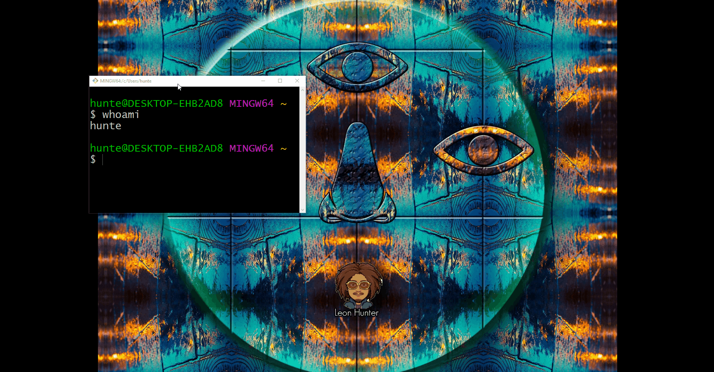
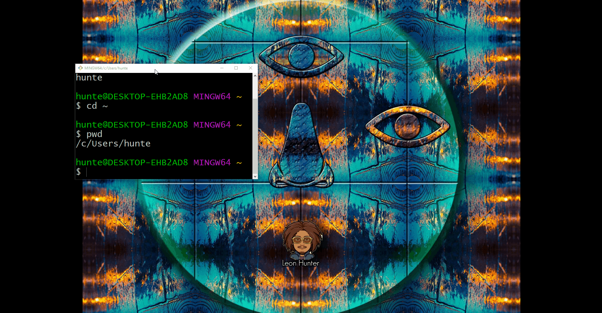
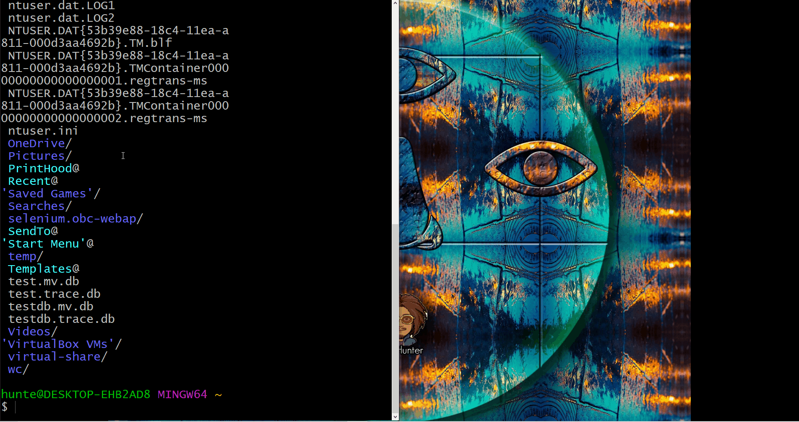
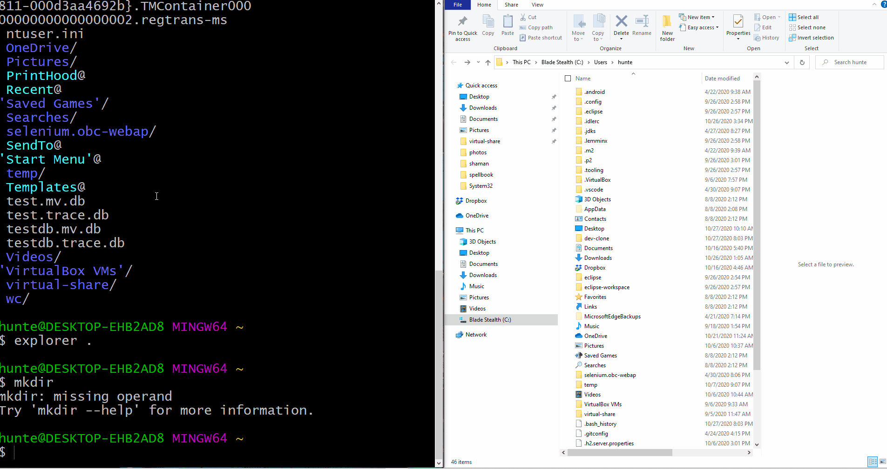
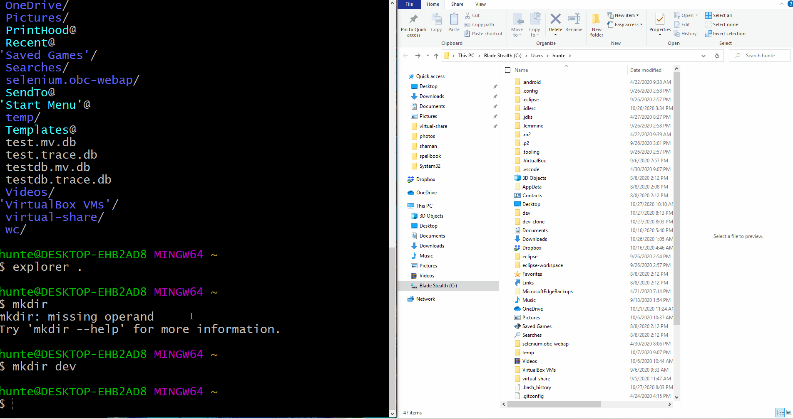

### Configuring File System for Application Development
* The purpose of the following section is to familiarize with basic commands while also creating the conventional file-system structure for application-development.

#### Part 1 - Opening The Terminal

* To open the git-bash terminal in OSX
    * press the `Windows` key to open _windows search_.
    * in the search bar, enter `git bash`.

* To open the terminal in OSX
    * hold `Command` and press `Space` to open the _spotlight search_.
    * in the search bar, enter `terminal`

#### Part 2 - Displaying your Username
* Upon opening the terminal, verify what your _username_ is.
    * enter `whoami` in the terminal.
    * The name of the account that is currently signed in should be displayed in the terminal's standard output.
* In the examples below, the name of the user-account is hunter

#### Part 3 - Home Directory
* To navigate to the _home directory_ enter `cd ~` in the terminal
    * `cd` is a _command_ used to _change directories_
    * `~` is an alias recognized by the shell to reference the _home directory_
* Verify that you are in your home directory by executing `pwd` to _print working directory_.
    * The _file path_ pointing to a directory with your _username_ should be displayed in the terminal's standard output.

    

#### Part 3 - Listing Files in the Current Directory
* To list all of the files in the current directory, execute `ls`

#### Part 4 - Opening the File Explorer
* To open the file explorer to get a graphical representation of the file system
    * execute `explorer .` from the Windows git-bash terminal
    * execute `open .` from the OSX terminal

#### Part 5 - Creating a Application-Development directory
* To create a new directory, named `dev`, execute `mkdir dev` from the home-directory.
    * `mkdir` is a _command_ used to create a new directory
    * `dev` is the name of the directory to be created
* Verify that newly created directory is visible in the shell, by executing `ls`.
    * The name of the directory, `dev`, should be displayed in the standard output.
* Verify that newly created directory is visible in the project explorer, by executing `explorer .` or `open .` respectively
    * The directory should be displayed as a folder in the project explorer

#### Part 6 - Change Directory to the `dev` directory
* To change the _current working directory_ to `dev`, execute `cd dev` from the home directory.
* Verify that the command has executed properly by executing `pwd` to display the _current working directory_.
    * The name of the current working directory, `~/dev`, should be displayed in the standard output.
* Verify that this directory is empty by executing `ls`
    * The standard output should not display anything

