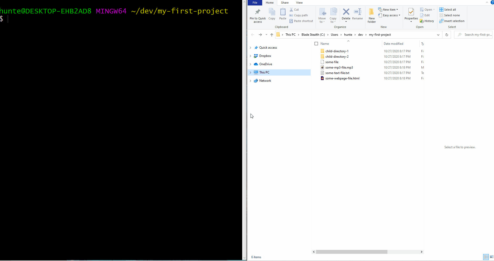

### Creating A New Project Directory in  `dev` directory
* The purpose of the following section is to re-familiarize with the aforementioned skills by creating a directory which contains files and other directories.


#### Part 1 - Opening The Terminal

* To open the git-bash terminal in OSX
    * press the `Windows` key to open _windows search_.
    * in the search bar, enter `git bash`.


* To open the terminal in OSX
    * hold `Command` and press `Space` to open the _spotlight search_.
    * in the search bar, enter `terminal`


#### Part 2 - Change Directory to the `dev` directory
* Execute `cd ~/dev` to change the _current working directory_ to `dev`
* `cd ~/dev` can be read verbally as "change directory to `home`, from here `navigate to` directory named `dev`"
    * `cd` is a _command_ used to _change directories_
    * `~` is an alias recognized by the shell to reference the _home directory_
    * `/` is a symbol used to express `navigate to`
* Execute `pwd` to display the _current working directory_ to verify that the command has executed properly.
* Execute `ls` to verify the contents of this directory.


#### Part 3 - Create a New Project Directory
* Execute `mkdir my-first-project` from the `dev` directory to create a new directory named `my-first-project` in the `dev` directory
* Execute `ls` to verify that the directory has been created properly.
* Execute `cd ./my-first-project` to change the _current working directory_ to the newly created directory.
* `cd ./my-first-project` can be read verbally as "change directory to `current working directory`, from here `navigate to` directory named `my-first-project`"
    * `cd` is a _command_ used to _change directories_
    * `.` is an alias recognized by the shell to reference the `current working directory`
    * `/` is a symbol used to express `from here, navigate to`
* Execute `pwd` to verify that you have navigated to the directory properly.

#### Part 5 - Create Directory Named `empty-directory`
* Execute `mkdir empty-directory` from the `my-first-project` directory to create a new directory named, `empty-directory`
* Execute `ls` to verify that the newly created directory, named has been created in the `my-first-project` directory.
* Execute `cd ./empty-directory` to change the _current working directory_ to the newly created director
* Execute `pwd` to verify that you have navigated to the directory properly.
* Execute `ls` to verify that this directory is empty.

#### Part 6 - Navigate Back to `my-first-project` directory
* Execute `cd ..` to change to the _parent directory_ of the _current working directory_.
    * `..` is an alias recognized by the shell to reference the `parent directory`.
    * A _parent directory_ is the directory which contains another directory.
        * (for example, `my-first-project` is a _child directory _ of the _parent directory_ named `dev`)
* Execute `pwd` to verify that you have navigated to the directory properly.
* Execute `ls` to verify this directory contains a directory named `empty-directory`.


#### Part 7 - Create Directory Named `non-empty-directory`
* Execute `mkdir non-empty-directory` from the `my-first-project` directory to create a new directory named `non-empty-directory`.
* Execute `ls` to verify that the newly created directory, named `non-empty directory` has been created in the directory named `my-first-project`.
* Execute `cd ./non-empty-directory` from the `my-first-project` directory to change the _current working directory_ to `non-empty-directory`.
* Execute `pwd` to verify that you have navigated to the directory properly.

#### Part 8 - Create Directories Within `non-empty-directory`
* Execute `mkdir child-directory-1` to create a new directory in the `non-empty-directory`
* Execute `ls` to verify that the newly created directory, named `child-directory-1` has been created in directory named `non-empty-direcory`.`
* Execute `mkdir child-directory-2` to create a new directory in the `non-empty-directory`
* Execute `ls` to verify that the newly created directory, named `child-directory-2` has been created in directory named `non-empty-direcory`.`


#### Part 9 - Create Files Within `non-empty-directory`
* Execute `touch some-file` to create a new file in the `non-empty-directory`
* Execute `touch some-text-file.txt` to create a new text file in the `non-empty-directory`
* Execute `touch some-webpage-file.html` to create a new webpage file in the `non-empty-directory`
* Execute `touch some-mp3-file.mp3` to create a new mp3 file in the `non-empty-directory`
* Execute `ls` to verify that each of the child-resources are displayed

```
child-directory-1
child-directory-2
some-file
some-mp3-file.mp3
some-text-file.txt
some-webpage-file.html
```

#### Part 10 - Open File in `nano` editor
* Execute `nano some-text-file.txt` to open the file named `some-text-file.txt` in the nano-editor.
* Enter your name in the nano editor.
* From the keyboard, hold `Ctrl` and press `X` to exit the editor
* From the keyboard, press `Y`, when prompted to `Save modified buffer`.
* From the keyboard, press `Enter`, when prompted to `Save File Name`.
* Execute `cat some-text-file.txt` to verify that the contents entered in the `nano` editor have been saved in the `some-text-file.txt` file.



#### Part 11 - Navigate Back to `my-first-project` directory
* Execute `cd ..` to change to the _parent directory_ of the _current working directory_.
    * `..` is an alias recognized by the shell to reference the `parent directory`.
    * A _parent directory_ is the directory which contains another directory.
        * (for example, `non-empty-directory` is a _child directory _ of the _parent directory_ named `my-first-project`)
* Execute `pwd` to verify that you have navigated to the directory properly.
* Execute `ls` to verify this directory contains a directory named `empty-directory` and `non-empty-directory`.


#### Part 12 - Delete `empty-directory`
* Execute `rmdir ./empty-directory` to delete the empty directory
    * **Note:** - The `rmdir` command cannot delete a non-empty directory
* Execute `ls` to verify that this directory no longer contains a directory named `empty-directory`

#### Part 13 - Delete `non-empty-directory`
* Execute `rmdir ./non-empty-directory` to verify that a directory that is not empty cannot be deleted via the command `rmdir`.
* Execute `ls` to verify that the _current working directory_ still contains a directory named `non-empty-directory`
* Execute `rm -rf ./non-empty-directory` to delete the the directory containing the content created in `Part 9` and `Part 10`
* Execute `ls` to verify that this directory no longer contains a directory named `non-empty-directory`


#### Part 14 - Fetching Command History
* Execute `history` to display the list of all the commands that have been executing in this terminal instance.
* Execute `history > submission.txt` to _pipe_ the output of the `history` command to a file named `submission.txt`
    * _piping_ is a mechanism for injecting data from one place to another
* Execute `cat submission.txt` to verify that the `submission.txt` file contains the expected contents.
